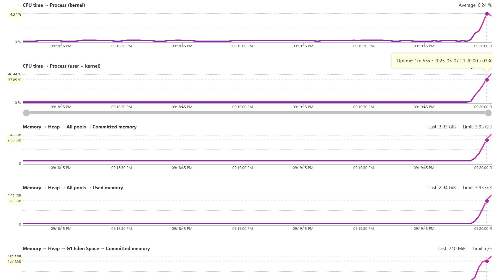
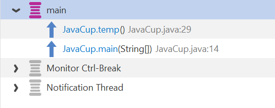

# Software_lab_5

پس از نصب برنامه `YourKit` باید پلاگین آن را به `intelliJ` اضافه کنیم. برای این کار گزینه `Profile from within the IDE` را انتخاب کرده و گزینه `intelliJ` را انتخاب می کنیم

همان طور که در تصویر زیر مشاهده می کنیم پلاگین `YourKit` اضافه شده است.

حال برنامه `JavaCup` را با پروفایلر اجرا می کنیم.

برنامه از ما سه ورودی می خواهد و پس از دادن این سه ورودی و اجرای توابع `temp` و `eval` نمودار فعالیت `CPU` و `Memory` در `YourKit` نمایش داده می شود و به شکل زیر می باشد.

همان طور که در تصویر بالا مشاهده می کنید، هم `CPU` و هم `Memory` در زمان `1m 55s` در نقطه پیک خود هستند. با بررسی دستوراتی که در این زمان در حال اجرا بودند متوجه شدیم که تابع `temp`، تابعی است که بیش ترین مصرف منابع را دارد. 

همچنین از درخت اجرای برنامه نیز می توانیم مشاهده کنیم که تابع `temp` بیش ترین زمان را به خود اختصاص داده است.

