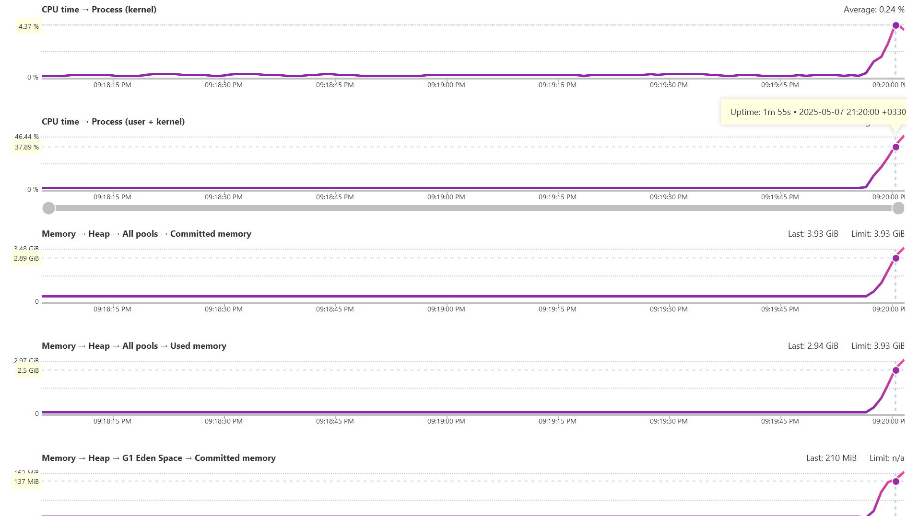
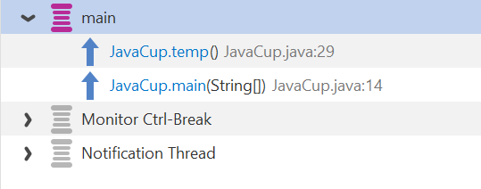
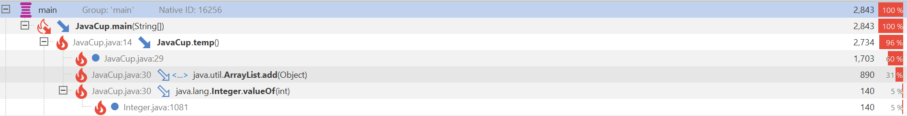
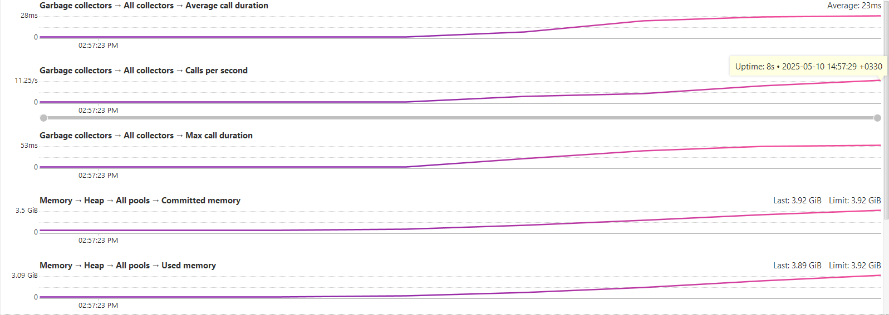
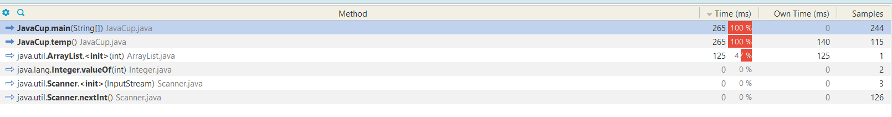
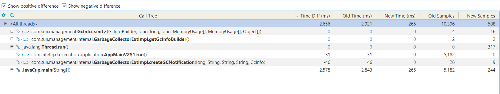
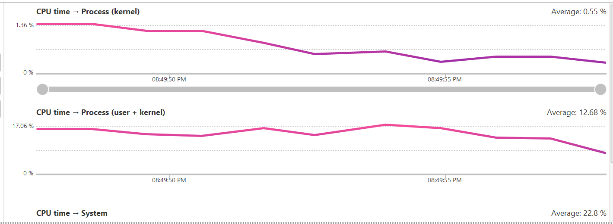
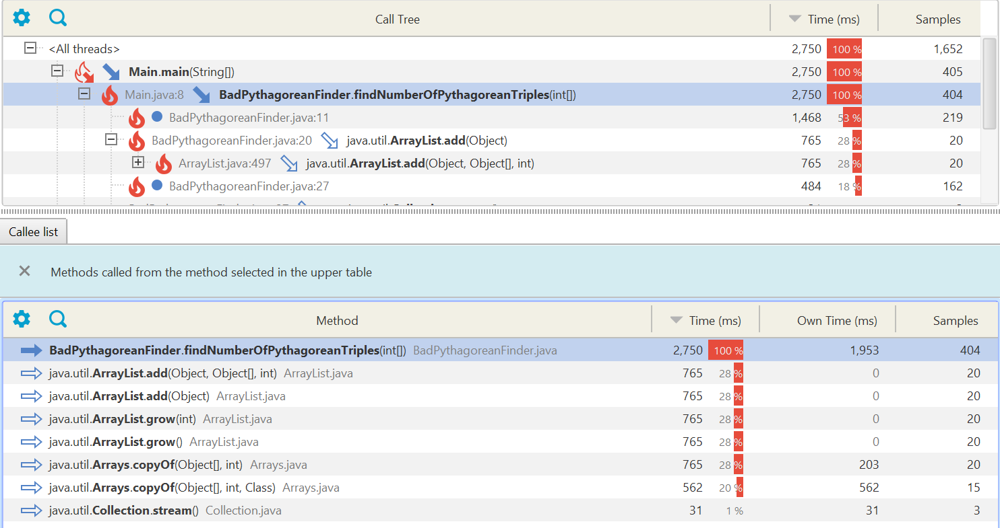
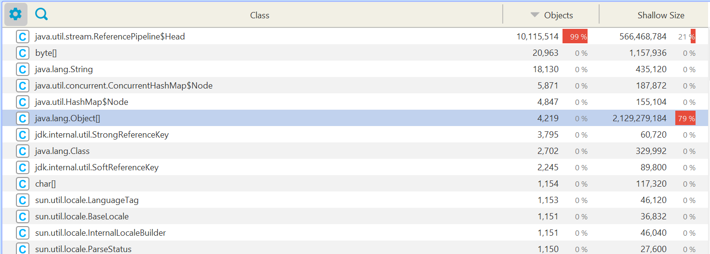
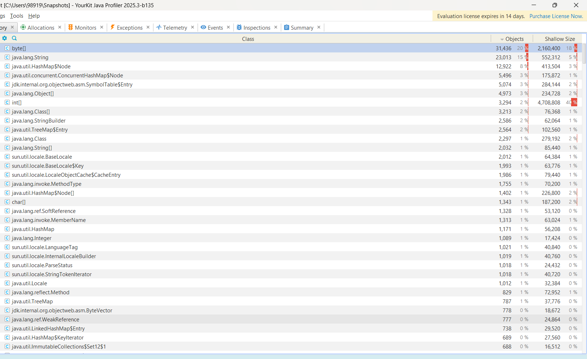

# Software_lab_5

پس از نصب برنامه `YourKit` باید پلاگین آن را به `intelliJ` اضافه کنیم. برای این کار گزینه `Profile from within the IDE` را انتخاب کرده و گزینه `intelliJ` را انتخاب می کنیم


همان طور که در تصویر زیر مشاهده می کنیم پلاگین `YourKit` اضافه شده است.


حال برنامه `JavaCup` را با پروفایلر اجرا می کنیم.

برنامه از ما سه ورودی می خواهد و پس از دادن این سه ورودی و اجرای توابع `temp` و `eval` نمودار فعالیت `CPU` و `Memory` در `YourKit` نمایش داده می شود و به شکل زیر می باشد.



همان طور که در تصویر بالا مشاهده می کنید، هم `CPU` و هم `Memory` در زمان `1m 55s` در نقطه پیک خود هستند. با بررسی دستوراتی که در این زمان در حال اجرا بودند متوجه شدیم که تابع `temp`، تابعی است که بیش ترین مصرف منابع را دارد. 



همچنین از درخت اجرای برنامه نیز می توانیم مشاهده کنیم که تابع `temp` بیش ترین زمان را به خود اختصاص داده است.




## بهبود پرفورمنس تابع `temp`


ابتدا ساختار اولیه این تابع را بررسی می کنیم:

```java
public static void temp() {
        ArrayList a = new ArrayList();
        for (int i = 0; i < 10000; i++)
        {
            for (int j = 0; j < 20000; j++) {
                a.add(i + j);
            }
        }
    }
```
در نسخه اول تابع` temp`، یک `ArrayList `برای ذخیره نتایج محاسباتی ایجاد شده بود و در هر تکرار از حلقه‌ها به آن مقادیر افزوده می‌شد. مشکل اصلی این بود که `ArrayList` به طور پویا فضای حافظه خود را افزایش می‌دهد زمانی که به ظرفیت فعلی خود نمی‌رسد. این کار می‌تواند باعث کاهش عملکرد شود، زیرا هر بار که فضای حافظه تمام می‌شود، `ArrayList` مجبور به تخصیص حافظه جدید و کپی کردن تمام داده‌ها به فضای جدید است. این فرآیند برای داده‌های زیاد مانند 10000 * 20000 می‌تواند خیلی زمان‌بر و پرهزینه باشد.

````java
     public static void temp() {

    ArrayList<Integer> a = new ArrayList<>(10000 * 20000);
    for (int i = 0; i < 10000; i++) {
        for (int j = 0; j < 20000; j++) {
            a.add(i + j);
        }
    }
}
````
حل این مشکل با تنظیم ظرفیت اولیه `ArrayList` به اندازه مورد انتظار (در اینجا 10000 * 20000) انجام شد. به این ترتیب، دیگر نیازی به تغییر اندازه `ArrayList` و تخصیص مجدد حافظه در حین اجرا نبود، که موجب بهبود قابل توجه عملکرد برنامه شد.
سپس مجدد برنامه را با پروفایلر اجرا می کنیم:



مشاهده می شود که پیک حافظه کمتر شده که یعنی حافظه مصرفی کمتر شده است.


از درخت اجرای برنامه مشخص است که مدت زمان اجرا کاهش یافته است.
 در شکل زیر این مقایسه را با انتخاب `compare` در` YourKit`  مشاهده می کنیم:




## پیاده سازی قطعه کدی دیگر

در پوشه 
`CustomJavaCode`
کدی پیاده سازی کرده ایم که آرایه ای تحت عنوان
`numbers`
را ورودی میگیرد و سپس در آن آرایه تعداد سه تایی های فیثاغورثی را پیدا میکند.
برای ورودی دادن به این تابع لیستی از
n 
عدد رندوم میسازیم و به تابع مورد نظر ورودی میدهیم.
این قطعه کد
تمام حالات ممکن را بررسی می کند و نتایج را در یک
`ArrayList`
ذخیره میکند.
اگر سه تایی یک سه تایی فیثاغورث بود عدد 1 و در غیر این صورت عدد 0 را به 
`ArrayList`
اضافه میکند.
در نهایت مقادیر محاسبه شده را جمع میزند و نتیجه را پس از تقسیم بر 2
باز میگرداند.
تقسیم بر 2 آن نیز به این خاطر است که هر سه تایی دوبار حساب میشود.

## نتایج پروفایل قطعه کد دیگر
`snapshot`
مربوط به آن در مسیر
`CustomJavaCode`
قرار داده شده است.

### تصاویر مربوط به `cpu time` :




همان طور که پیداست اکثر زمان cpu در تابع
`find umberOfPythagoreanTriples`
صرف شده است و در این تابع هم مقدار زیادی به
اضافه کردن عضو به
`ArrayList`
گذشته است.
مقداری نیز به
`iterate`
کردن 
`stream`
گذشته است.

### تصویر مربوط به مصرف رم:


همان طور که پیداست حجم بسیار زیادی 
`object[]`
در این کد 
allocate
شده است که میتوان آن را بهبود زیادی داد.


###  مشکل پرفورمنس: 

کد فعلی از آرایه‌ای به نام ArrayList<Integer> برای ذخیره نتایج مقایسه‌ها (0 یا 1) استفاده می‌کند. این باعث مصرف حافظه زیاد و انجام عملیات غیرضروری برای شمارش نتایج می‌شود. علاوه بر این، زمان اجرای برنامه به دلیل استفاده از سه حلقه تو در تو به پیچیدگی  O(n 3 ) می‌رسد که بهینه نیست.

### بهبود پرفورمنس: 

برای بهبود این کد، به جای ذخیره‌سازی نتایج مقایسه‌ها در یک ArrayList، می‌توان به‌طور مستقیم شمارش تعداد ترکیب‌های صحیح (Pythagorean Triples) را انجام داد. همچنین با حذف آرایه اضافی و انجام عملیات شمارش به‌طور مستقیم، حافظه و زمان اجرای برنامه بهینه می‌شود. به‌علاوه، از آنجا که هر سه عدد به‌طور مکرر بررسی می‌شوند، تعداد نهایی باید بر ۲ تقسیم شود تا از شمارش مجدد جلوگیری شود.

تصویر زیر نتیجه اجرا پس از بهینه سازی را نمایش می دهد که حجم تخصیص ها به وضوح بهبود پیدا کرده است:

